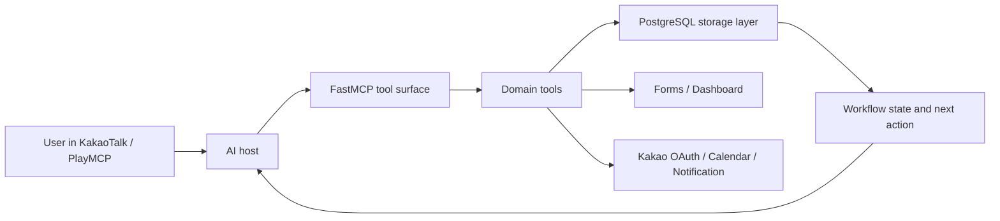

# Teamplay Talk

[日本語](#日本語) | [English](#english) | [한국어](#한국어)

## 日本語

### 概要

Teamplay Talkは、AIがチームプロジェクトのプロジェクトマネージャーとして機能するように設計した、MCPベースのコラボレーションサービスです。韓国のメッセンジャーサービス「KakaoTalk」を運営するKakaoのPlayMCPコンテストに向け、2026年6月24日から7月7日まで2人チームで開発しました。

メッセンジャー、アンケート、カレンダー、ドキュメントに分散した決定事項を、PostgreSQL上の共有状態へ集約します。AIは自然言語で計画を提案するだけでなく、ロードマップ、担当、フォーム、予定、ToDoを読み書きし、実際の完了状態に基づいて次の行動を案内します。

> 開発状況: コンテスト向けプロトタイプ。現在、継続開発の予定はありません。

### プロダクトフロー

1. リーダーがプロジェクトルームを作成し、招待リンクを共有する
2. メンバーがKakao認証を行い、同じルームへ参加する
3. AIがテーマと期限からロードマップのタスクグラフを作成する
4. ネイティブフォームで役割の希望・回避やチームの意見を収集する
5. マイルストーンを個人別ToDoと日程へ分解する
6. ダッシュボード、KakaoTalk通知、Talk Calendarで進捗と次の行動を確認する

### 技術的に注力した点

#### 1. 会話上の計画を、変更可能なロードマップグラフへ変換

一列のタスクリストでは依存関係や並行作業を表現しにくいため、ロードマップをタスクノードと先行・後続エッジに分け、`tasks`と`task_deps`へ保存しました。AIが生成する一時キーを、単一トランザクション内でDB IDへ変換してからエッジを接続します。グラフ全体の作成だけでなく、既存タスクの前後へタスクを追加する部分更新にも対応しています。

プロンプトだけで実行順序を守らせると、前提条件を満たさないまま後続処理へ進むことがありました。そこで、ルーム、メンバー、フォーム、ロードマップ、役割、ToDoのDB状態をワークフロー判定の基準にし、ツール結果へ次に実行可能な操作を構造化して返すようにしました。フォームの「作成」と「送信」も別状態として扱い、未送信のフォームを完了済みと案内しないようにしています。

#### 2. PlayMCPとKakao OAuthの仕様差を吸収

PlayMCPはOAuthクライアント情報をHTTP Basicで渡しますが、Kakaoのトークンエンドポイントはrequest bodyを要求します。両サービスの仕様を変更できないため、認証情報をKakao形式へ変換するtoken proxyを実装しました。招待コードと有効期限はHMAC署名したOAuth stateへ含め、認証後に対象ルームへ参加できるようにしています。

Kakao access/refresh tokenはFernetで暗号化して保存し、平文と暗号文を区別するversion prefix、二重暗号化の防止、既存データの暗号化script、key rotation scriptを用意しました。

### 主な担当範囲

- PostgreSQLの保存層、ルーム・メンバー・共有状態の設計
- ロードマップのタスクグラフ、部分更新、次アクション制御
- ネイティブフォーム・投票、ダッシュボード、KakaoTalk Calendar連携
- OAuth token proxy、招待state署名、保存token暗号化とkey rotation
- Docker環境、デプロイと障害修正

### 主な機能

- ルーム作成・参加・切替・退出と、ユーザーごとのactive room
- SurveyJSによるフォーム・投票、単一選択・複数選択・自由記述、集計と自動締切
- ロードマップ、マイルストーン日程、個人別ToDo、daily check-in/report
- 役割希望・回避の収集と役割割り当てフロー
- Kakao OAuth、Talk Calendar CRUD、ルーム通知
- メンバー、決定事項、フォーム結果、ロードマップ、ToDoを統合したダッシュボード

### アーキテクチャ



公開ツールは、8個のdomain hubと7個の独立ツール、合計15個に整理しています。MCPツールはSQLを直接組み立てず、`storage.py`を介してアクセスします。statelessなMCP requestでも、ユーザーのactive roomとmembershipを毎回確認します。

### 技術スタック

- Backend: Python 3.11+, FastMCP 3.4.3+
- Data: PostgreSQL
- Web: SurveyJS, HTML, CSS, JavaScript
- Integration: Kakao OAuth, KakaoTalk Calendar API
- Infrastructure: Docker, Docker Compose, Caddy

### ローカル実行

```bash
uv venv
uv pip install -e .

# .env.exampleを参考に.envを作成
uv run python scripts/init_db.py
uv run python -m teamplay_talk.server
```

- MCP endpoint: `http://localhost:8000/mcp/`
- Health check: `http://localhost:8000/health`

最低限`DATABASE_URL`が必要です。Kakao連携には`KAKAO_REST_API_KEY`、`KAKAO_CLIENT_SECRET`、`KAKAO_REDIRECT_URI`を使用します。本番環境では`TOKEN_ENC_KEY`と`INVITE_STATE_SECRET`も設定してください。

---

## English

### Overview

Teamplay Talk is an MCP-based collaboration service in which an AI acts as the project manager for a team. It was built by a two-person team from June 24 to July 7, 2026, for Kakao's PlayMCP competition. Kakao operates KakaoTalk, a widely used messaging service in Korea.

The service turns decisions scattered across chat, surveys, calendars, and documents into shared PostgreSQL state. Instead of stopping at a conversational plan, the AI can read and update roadmaps, roles, forms, schedules, and personal tasks, then guide the team from the state that was actually completed.

> Status: competition prototype; no further development is currently planned.

### Product flow

1. A leader creates a project room and shares an invite link.
2. Members authenticate with Kakao and join the same room.
3. The AI builds a roadmap task graph from the project topic and deadline.
4. Native forms collect role preferences, exclusions, and team feedback.
5. Milestones are decomposed into dated, member-level tasks.
6. The dashboard, KakaoTalk notifications, and Talk Calendar expose progress and next actions.

### Engineering focus

#### Executable roadmap graph

Roadmaps are stored as task nodes and dependency edges in separate `tasks` and `task_deps` tables. AI-generated temporary keys are mapped to database IDs inside one transaction before edges are inserted. The system supports both whole-graph creation and local edits such as inserting a task before or after existing nodes.

Prompt-only ordering was not reliable enough for a multi-step PM workflow. The server therefore derives the next valid action from persisted room, member, form, roadmap, role, and task state. Tool results distinguish creation from delivery—for example, a form remains `sent: false` until the send operation actually succeeds.

#### OAuth boundary and token security

PlayMCP sends OAuth client credentials with HTTP Basic authentication, while Kakao expects them in the token request body. A token proxy translates between the two fixed protocols. Signed OAuth state carries the invite code and expiry so authentication can continue into room membership.

Kakao access and refresh tokens are encrypted with Fernet. Versioned ciphertext, double-encryption guards, a migration script for legacy plaintext, and a key-rotation script support safer operation.

### Primary contribution

- PostgreSQL storage layer and shared room/member state
- Roadmap task graph, partial graph updates, and next-action workflow control
- Native forms and polls, dashboard, and KakaoTalk Calendar integration
- OAuth token proxy, signed invite state, token encryption, and key rotation
- Docker deployment and production issue fixes

### Architecture and stack

- Backend: Python 3.11+, FastMCP 3.4.3+
- Data: PostgreSQL
- Web: SurveyJS, HTML, CSS, JavaScript
- Integration: Kakao OAuth and KakaoTalk Calendar API
- Infrastructure: Docker, Docker Compose, Caddy

The public MCP surface is consolidated into 15 tools: eight domain hubs and seven standalone tools. Tools access SQL only through `storage.py`, and each stateless request revalidates the user's active room and membership.

### Run locally

```bash
uv venv
uv pip install -e .

# Create .env from .env.example
uv run python scripts/init_db.py
uv run python -m teamplay_talk.server
```

- MCP endpoint: `http://localhost:8000/mcp/`
- Health check: `http://localhost:8000/health`

---

## 한국어

Teamplay Talk는 AI가 팀 프로젝트의 PM 역할을 수행하도록 만든 MCP 기반 협업 서비스입니다. 카카오 PlayMCP 공모전을 위해 2026년 6월 24일부터 7월 7일까지 2인 팀으로 개발했습니다.

일정, 역할, 투표, 회의 결과와 할 일이 여러 도구에 흩어지는 문제를 해결하기 위해, AI의 자연어 제안을 PostgreSQL에 저장되는 공동 상태와 실행 가능한 workflow로 연결합니다.

## 대표 흐름

1. 팀장이 방을 만들고 초대 링크를 공유합니다.
2. 팀원이 카카오 인증 후 방에 참여합니다.
3. AI가 주제와 마감일을 바탕으로 roadmap task graph를 만듭니다.
4. 네이티브 폼으로 역할 선호·회피와 팀 의견을 수집합니다.
5. 응답을 바탕으로 역할을 배정하고 milestone을 개인별 todo와 일정으로 분해합니다.
6. 대시보드, 카카오 알림과 Talk Calendar에서 팀 상태와 다음 행동을 확인합니다.

## 주요 기능

- **방과 멤버십**: 방 생성·참여·전환·나가기, 사용자별 active room
- **네이티브 폼·투표**: SurveyJS 응답 화면, 단일·복수 선택과 텍스트 응답, 결과 집계와 자동 종료
- **역할 배정**: roadmap 기반 책임 카드, 선호·회피 조사, 역할 누락과 편중을 줄이는 배정안, 팀장 확인 후 저장
- **Roadmap·업무**: task/edge graph, milestone 일정화, 실행 todo 분해, 멤버별 오늘·이번 주·지연 업무
- **Kakao 연동**: OAuth, 초대 후 방 참여, Talk Calendar 일정 CRUD, 팀 알림
- **대시보드**: 방·멤버·결정·폼 결과·roadmap·개인별 업무 feed
- **자동 운영**: daily check-in, daily report와 task digest

## MCP 도구 구성

PlayMCP에서 유사한 도구를 구분하기 쉽도록 공개 surface를 15개로 정리했습니다.

- Domain hub 8개: `room_manage`, `form_manage`, `role_manage`, `roadmap_manage`, `task_manage`, `daily_manage`, `calendar_team`, `calendar_personal`
- 독립 도구 7개: `create_poll`, `gather_opinions`, `gather_locations`, `gather_task_opinions`, `schedule_meeting`, `notify_room`, `room_dashboard`

각 응답은 필요한 경우 `required_next_tool`, `required_next_action`, `required_next_arguments`를 반환합니다. 내부 tool-call 문법은 사용자 안내와 분리합니다.

## 기술 스택

- Python 3.11+
- FastMCP 3.4.3+, Streamable HTTP, custom web routes
- PostgreSQL, psycopg 3, psycopg_pool
- httpx, cryptography(Fernet)
- SurveyJS, HTML, CSS, JavaScript
- Docker, Docker Compose, Caddy

## 구조

```text
src/teamplay_talk/
├─ server.py             # FastMCP 서버와 web route 등록
├─ storage.py            # PostgreSQL 접근과 transaction
├─ tools/                # MCP domain tool과 공개 hub
├─ forms_web.py          # 폼 응답 화면
├─ dashboard_web.py      # 팀 대시보드
├─ auth_web.py           # 카카오 인증·초대 흐름
├─ kakao_token_proxy.py  # PlayMCP와 Kakao token endpoint 변환
└─ crypto.py             # 저장 token 암호화
```

MCP tool은 SQL을 직접 조립하지 않고 `storage.py`를 통해 데이터에 접근합니다. 세션 없는 요청에서도 사용자별 `active_room_id`와 room membership을 매번 확인해 협업 문맥을 유지합니다.

## 인증과 보안

- 카카오 access/refresh token은 `TOKEN_ENC_KEY`가 설정된 환경에서 Fernet으로 암호화합니다.
- 초대 OAuth state와 대시보드 접근 token은 HMAC 서명과 만료 시간을 검증합니다.
- 기존 평문 token은 `scripts/encrypt_tokens.py`, 키 교체는 `scripts/rotate_token_key.py`로 처리할 수 있습니다.
- `.env`는 Git에 커밋하거나 Docker 이미지에 복사하지 않습니다. 운영 비밀값은 배포 환경의 secret/runtime environment 기능으로 주입해야 합니다.

## 로컬 실행

```bash
uv venv
uv pip install -e .

# .env.example을 참고해 로컬 .env를 작성
uv run python scripts/init_db.py
uv run python -m teamplay_talk.server
```

- MCP endpoint: `http://localhost:8000/mcp/`
- Health check: `http://localhost:8000/health`

주요 환경변수는 `.env.example`을 참고하세요. 최소한 `DATABASE_URL`이 필요하며, 카카오 연동에는 `KAKAO_REST_API_KEY`, `KAKAO_CLIENT_SECRET`, `KAKAO_REDIRECT_URI`를 사용합니다. 운영에서는 `TOKEN_ENC_KEY`와 `INVITE_STATE_SECRET`도 설정해야 합니다.

## 배포 주의사항

Docker image에는 애플리케이션 코드만 포함합니다. 배포 플랫폼이 runtime secret 주입을 지원하지 않는다면 비밀값을 image에 굽지 말고, Secret Manager를 사용할 수 있는 환경으로 배포 방식을 변경해야 합니다.
